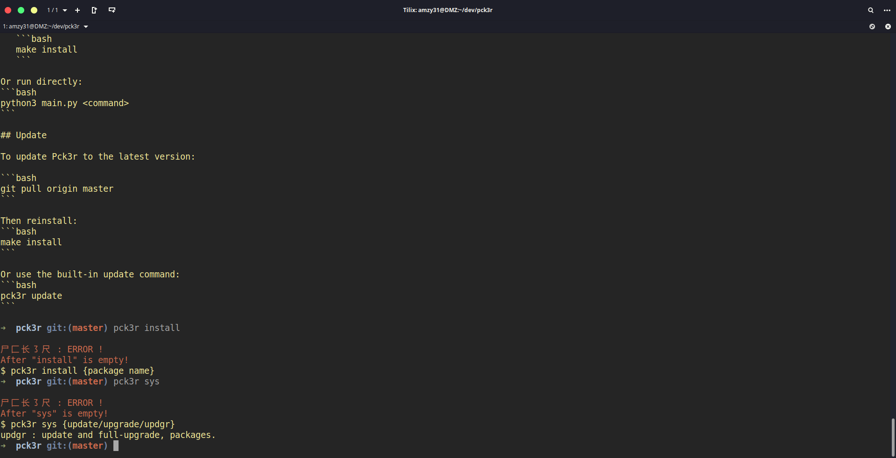

# Pck3r



Pck3r is a user-friendly command-line tool designed for Linux novices. Written in Python, it simplifies package management and system operations on Ubuntu 24.04 using the apt package manager.

Pck3r is created by Amzyei (Amin Azimi) and is licensed under GPL3. Contributions are welcome—feel free to send pull requests on GitHub: https://github.com/amzy31/pck3r. New features will be added to Pck3r soon!

## Logo

```
  尸⼕长㇌尺
```

## Overview

Hey Linux friends! Pck3r makes Ubuntu 24.04 package management simple and fun. No more complex apt commands - just easy, memorable ones. Perfect for beginners and pros alike!

## Commands

### Install Command

Install packages or tools. Pck3r supports built-in installations for popular tools and falls back to apt for other packages.

Built-in packages (special installation methods):
- nodejs (Node.js)
- ohmyzsh (Oh My Zsh)
- firefox (Mozilla Firefox)
- google-chrome (Google Chrome)
- steam (Steam gaming platform)
- discord (Discord chat app)
- vscode (Visual Studio Code)
- skype (Skype)
- zoom (Zoom video conferencing)
- vlc (VLC media player)
- virtualbox (VirtualBox virtualization)
- wine (Wine for running Windows apps)

```bash
pck3r install <package>
```

Examples:
- `pck3r install nodejs`
- `pck3r install google-chrome`
- `pck3r install <any_other_package>` (uses apt)

### Clear Command

Clear your terminal screen:

```bash
pck3r clear
```

### System Commands

Manage your operating system:

- Update package lists:
  ```bash
  pck3r sys update
  ```

- Upgrade installed packages:
  ```bash
  pck3r sys upgrade
  ```

- Full upgrade (update and upgrade):
  ```bash
  pck3r sys updgr
  ```

### Package Commands

List built-in Pck3r packages or search for available apt packages:

- List built-in packages:
  ```bash
  pck3r pkg
  ```

- Check if a package is built-in or search for apt packages:
  ```bash
  pck3r pkg <package_name>
  ```

  If `<package_name>` is a built-in Pck3r package, it will notify you. Otherwise, it uses `apt search` to find available packages in the repositories.

### Version

Check Pck3r version:

```bash
pck3r version
```

## Web Interface

For a graphical web-based interface (Ubuntu 24.04 only), open `index.html` in your web browser. This provides a user-friendly way to install packages and run system commands without using the command line. The web interface displays the exact bash commands to run in your terminal for installation.

## Installation

To install Pck3r globally:

1. Ensure Python 3 is installed on your system (comes pre-installed on most Linux distributions)

2. Clone the repository:
   ```bash
   git clone https://github.com/amzy31/pck3r
   ```

3. Navigate to the directory:
   ```bash
   cd pck3r
   ```

4. Install globally:
   ```bash
   make install
   ```

Or run directly:
```bash
python3 main.py <command>
```

## Update

To update Pck3r to the latest version:

```bash
git pull origin master
```

Then reinstall:
```bash
make install
```

Or use the built-in update command:
```bash
pck3r update
```
